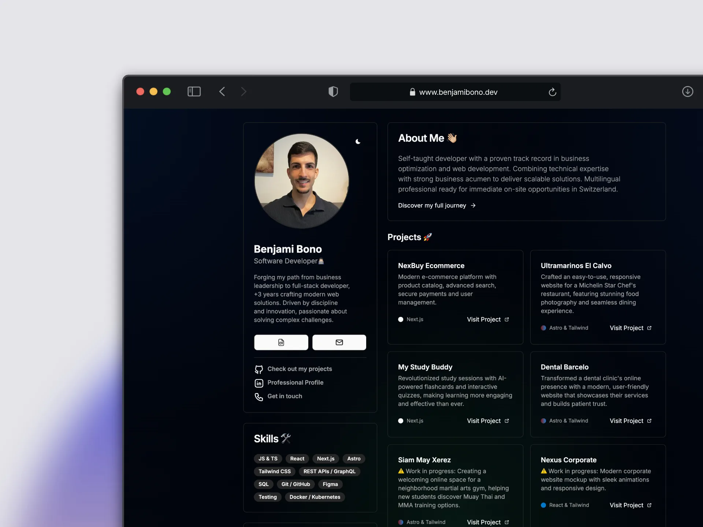

# Benjami Bono - Tech Lead Portfolio

A modern, high-performance portfolio website showcasing my journey as a Tech Lead and Full Stack Developer. Built with cutting-edge technologies for optimal performance, accessibility, and user experience.

<div align="center">
  <a href="https://astro.build" target="_blank">
    
  </a>
  <a href="https://tailwindcss.com" target="_blank">
    
  </a>
  <a href="https://vercel.com" target="_blank">
    
  </a>
</div>

<br />

<div align="center">
  <div style="display: flex; justify-content: center; gap: 20px; margin: 40px 0;">
    
  </div>
</div>

<br />

## 🌟 Features

- **⚡ Lightning Fast**: Built with Astro 5 for optimal performance and instant page loads
- **📱 Fully Responsive**: Seamless experience across all devices and screen sizes
- **🎨 Modern UI/UX**: Clean, professional interface with smooth animations
- **🌓 Dark/Light Mode**: Animated theme switching with View Transitions API
- **♿ Accessible**: WCAG AAA compliant with semantic HTML and ARIA labels
- **🚀 SEO Optimized**: Sitemap, JSON-LD structured data, and optimized meta tags
- **🖼️ Image Optimization**: WebP format with responsive sizing and lazy loading
- **🔒 Security Hardened**: CSP headers and security best practices
- **📊 Project Showcase**: Highlighting production-ready full-stack applications

## 🛠️ Tech Stack

**Core:**
- **Framework**: [Astro 5.17](https://astro.build) - Modern static site generator
- **Styling**: [Tailwind CSS 4.1](https://tailwindcss.com) - Utility-first CSS framework
- **Language**: TypeScript - Type-safe development

**Performance & Optimization:**
- **Image Processing**: Sharp - High-performance image optimization
- **Fonts**: Inter Variable - Self-hosted for optimal loading
- **SEO**: @astrojs/sitemap - Automatic sitemap generation

**Deployment & Infrastructure:**
- **Hosting**: [Vercel](https://vercel.com) - Edge network deployment
- **CI/CD**: Automated builds and deployments
- **Security**: Custom CSP headers and security policies

## 🚀 Getting Started

1. Clone the repository:

```bash
git clone https://github.com/benjamibono/portfolio.git
cd portfolio
```

2. Install dependencies:

```bash
npm install
```

3. Start the development server:

```bash
npm run dev
```

4. Build for production:

```bash
npm run build
```

5. Preview production build:

```bash
npm run preview
```

## 📊 Performance

- **Lighthouse Score**: 100/100 (Performance, Accessibility, Best Practices, SEO)
- **First Contentful Paint**: < 0.5s
- **Time to Interactive**: < 1s
- **Total Bundle Size**: < 50KB (gzipped)

## 📦 Project Structure

```
portfolio/
├── public/              # Static assets (images, CV, certificates)
├── src/
│   ├── assets/         # Optimized images and icons
│   ├── components/     # Reusable UI components
│   ├── constants/      # Site metadata and project data
│   ├── layouts/        # Page layouts
│   ├── pages/          # Route pages
│   ├── styles/         # Global styles and Tailwind config
│   └── types/          # TypeScript type definitions
├── docs/               # Project documentation
├── astro.config.mjs    # Astro configuration
├── package.json        # Dependencies and scripts
└── vercel.json         # Deployment and security headers
```

## 🔧 Configuration

**Key Configuration Files:**

- `astro.config.mjs` - Astro framework settings, integrations, and build options
- `src/styles/global.css` - Tailwind v4 configuration with custom theme
- `vercel.json` - Security headers and deployment settings
- `package.json` - Dependencies, scripts, and project metadata

**Environment Variables:**

No environment variables required for basic functionality. The site is fully static.

## 📝 License

This project is licensed under the MIT License - see the [LICENSE](LICENSE) file for details.

## 🎯 Key Projects Featured

- **Siam May** - Full-stack gym management with real-time scheduling
- **Recipe Master** - AI-powered recipe platform with nutritional analysis
- **NexBuy Ecommerce** - Modern e-commerce with secure payments
- **My Study Buddy** - AI-powered flashcards and interactive quizzes

## 🤝 Connect With Me

Currently Tech Lead at [21 Impact Labs](https://21impact.com), leading the xponetiq Premium platform development.

- 🌐 Portfolio: [benjamibono.dev](https://benjamibono.dev)
- 💼 LinkedIn: [Benjami Bono](https://linkedin.com/in/benjamibono)
- 💻 GitHub: [@benjamibono](https://github.com/benjamibono)
- 📧 Email: benjamibono@gmail.com

## 📄 License

This project is open source and available under the [MIT License](LICENSE).

---

<div align="center">
  <p>Built with ❤️ by <a href="https://benjamibono.dev">Benjami Bono</a></p>
  <p>Tech Lead | Full Stack Developer | Based in Zürich, Switzerland 🇨🇭</p>
</div>
